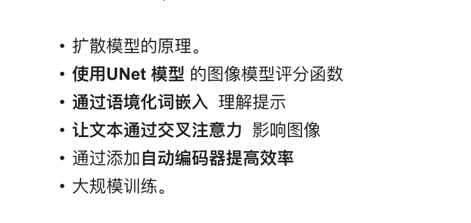
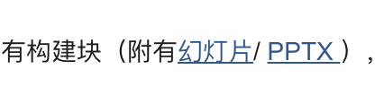
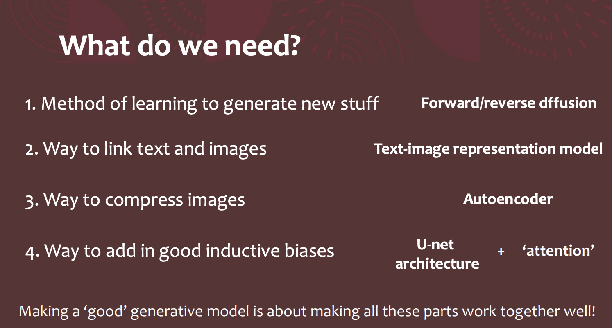
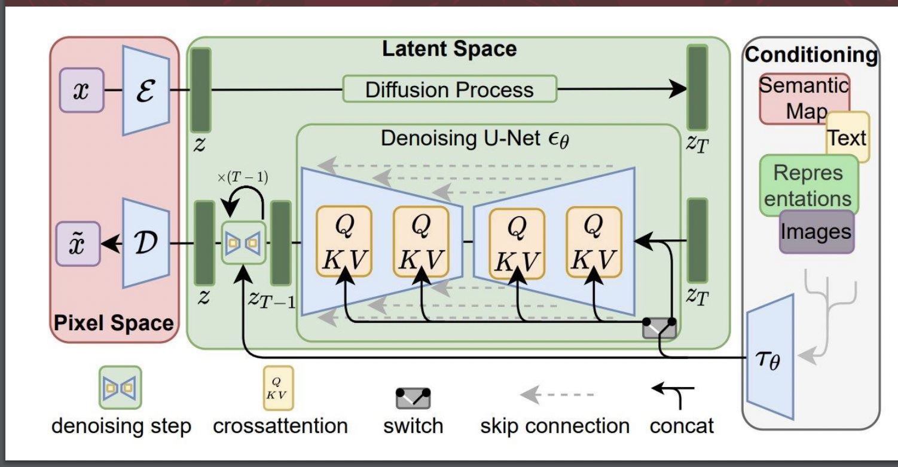
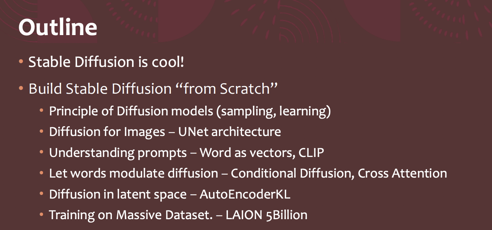
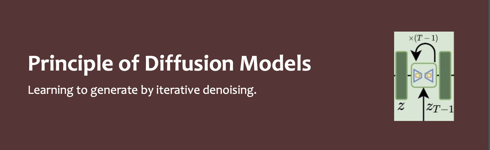
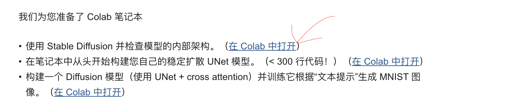
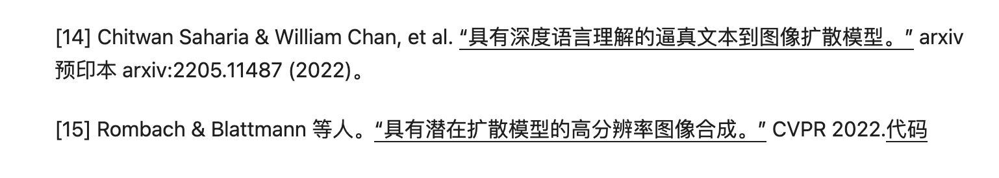

# stable diffusion算法学习路径

# 了解 

## github网站

他是实现了什么功能，一些扩展实现了一些额外功能，

部署实现的要求。

了解引申或者重视出来的专有名词

扩散模型

## Paper

网络结构是什么样的，用了什么算法以及新的方法在里面。复现的难度大不大

了解引申出来的专有名词

##  boss等招聘网站

公司招聘要什么能力，的实际要求

了解引申出来的专有名词

# 体验

体验一下效果具体落地还差多少，或者还有什么可以改善的。

如果有新的相关技术或应用出现，要继续去体验一下。

## huggingface

## 官方网页

## colab免费云服务器部署一下

看一下b站，或者youtube的教程

## 同类型研究

和他类似的模型有哪一些，体验一下功能。

# 寻找资料

根据前面获得的资料，一些个人和他人经验确定学习的目标。

通过专有名词去寻找，stable diffusion，diffusion ，

stable diffusion from scratch 或者coding stable diffusion by pytorch

diffusion from scratch 或者coding  diffusion by pytorch

stable diffusion dreembooth

stable diffusion lora

stable diffusion controlnet

## 从b站找寻找入门相关资料

没找到关于stable difusion的内容，只有diffusion的。

Probabilistic Diffusion Model概率扩散模型的理论与完整PyTorch代码实现

https://www.bilibili.com/video/BV1b541197HX/?spm_id_from=333.788&vd_source=6d6126fdf98a0a7f2e284aa4d2066198

Score Diffusion Model分数扩散模型理论与完整PyTorch代码详细解读

https://www.bilibili.com/video/BV1Dd4y1A7oz/?spm_id_from=333.788&vd_source=6d6126fdf98a0a7f2e284aa4d2066198

概率扩散模型(DDPM)与分数扩散模型(SMLD)的联系与区别

https://www.bilibili.com/video/BV1QG4y1674Q/?spm_id_from=333.788&vd_source=6d6126fdf98a0a7f2e284aa4d2066198

diffusion model 唐宇迪

https://www.bilibili.com/video/BV1j54y1T7WQ?p=3&vd_source=6d6126fdf98a0a7f2e284aa4d2066198

Classifier Guided Diffusion Model条件扩散模型的论文解读与PyTorch代码

https://www.bilibili.com/video/BV1m84y1e7hP/?spm_id_from=333.788&vd_source=6d6126fdf98a0a7f2e284aa4d2066198

扩散概率模型的几个进展，包括求解最优方差的Analytic-DPM、快速求解扩散ODE的DPM-Solver算法、大规模多模态扩散模型等

https://www.bilibili.com/video/BV1Vs4y1A7Ao/?spm_id_from=333.337.search-card.all.click&vd_source=6d6126fdf98a0a7f2e284aa4d2066198

## 从google寻找深入知识的资料

Understanding Stable Diffusion from "Scratch" 哈佛医学院

https://scholar.harvard.edu/binxuw/classes/machine-learning-scratch/materials/stable-diffusion-scratch

## 从youtube寻找深入知识的资料

稳定扩散，潜在扩散 ddpm， Jeremy HowardKaggle 的总裁兼首席科学家

https://course.fast.ai/

https://www.youtube.com/@howardjeremyp/videos

李弘毅淺談圖像生成模型 Diffusion Model 原理

https://www.youtube.com/watch?v=azBugJzmz-o&list=PLJV_el3uVTsOePyfmkfivYZ7Rqr2nMk3W&index=16

Generative art using diffusion OpenAI 研究科学家

https://www.youtube.com/watch?v=xYJEvihz3OI

Diffusion Probabilistic Models, Jascha Sohl-Dickstein谷歌大脑组高级研究科学家

https://www.youtube.com/watch?v=XCUlnHP1TNM

## 从一些付费机构找一些资料

DDPM 论文精读

https://www.malaedu.com/detail/l_63a3e7fee4b0fc5d121a2f54/4?from=p_63858acae4b0fc5d120c0e89&content_app_id=&type=6

## 咨询一些从事相关行业的好友

# 综合能找到的资料制定学习计划和方向

## __1__ 看这个网站链接day2

Understanding Stable Diffusion from "Scratch"

https://scholar.harvard.edu/binxuw/classes/machine-learning-scratch/materials/stable-diffusion-scratch

### 看到讲了一下这个课的内容

这个内容我们可以了解到要学习哪些内容

## 2看到了这ppt

说到了我们要学什么

stable diffusion的网络结构图

#### 重要Some Resources 

这很重要但是我复制不过来

讲了一下这个课程的内容跟上面说的差不多

看到了这个部分然后下面的开始看不懂了

## 3回头看网站里面有一个colab

然后看代码学习相关的知识

自己添加注释以及说明文本。

然后看到这里不懂了，但是大概了解stable diffusion。

## 4看一下网站里面另外两个colab

- 在笔记本中从头开始构建您自己的稳定扩散 UNet 模型。（< 300 行代码！）（[在 Colab 中打开](https://colab.research.google.com/drive/1mm67_irYu3qU3hnfzqK5yQC38Fd5UFam?usp=sharing)）

- 构建一个 Diffusion 模型（使用 UNet + cross attention）并训练它根据“文本提示”生成 MNIST 图像。（[在 Colab 中打开](https://colab.research.google.com/drive/1Y5wr91g5jmpCDiX-RLfWL1eSBWoSuLqO?usp=sharing)）

  所以要学 UNet，  diffusion，cross attention，但你都还不会，要学哪一个呢

## 5继续看网站

网站最下面有

讲解扩散模型相关的

## 6看一下 什么是扩散模型｜小日志

https://lilianweng.github.io/posts/2021-07-11-diffusion-models/

虽然我看不太懂，但是我看一下，大概内容以及他的参考，根据时间顺序你就可以看到他们的发展，重点的理论

最后那一个参考，点他的代码，去到github，就能看到 stable diffusion的网络图。以及父仓库有stable diffusion的仓库。

## 7再看看网站里面有什么资料

稳定扩散

​       带注释和简化的代码：[U-Net for Stable Diffusion (labml.ai)](https://nn.labml.ai/diffusion/stable_diffusion/model/unet.html)

​       插图：[图解稳定扩散——Jay ](https://jalammar.github.io/illustrated-stable-diffusion/)[Alammar](https://jalammar.github.io/illustrated-stable-diffusion/)

-------day3---------

## 8看[图解稳定扩散——Jay ](https://jalammar.github.io/illustrated-stable-diffusion/)[Alammar](https://jalammar.github.io/illustrated-stable-diffusion/) 

了解了稳定扩散的组成

了解什么是扩散

了解怎么加快扩散生成图片

了解怎么把文本添加到扩散过程中来影响图片生成

## 9去看一下这个带注释和简化的代码：[U-Net for Stable Diffusion (labml.ai)](https://nn.labml.ai/diffusion/stable_diffusion/model/unet.html)

## 10要去了解一下diffusion（开始自己决定看什么了）

[What are Diffusion Models? | ](https://lilianweng.github.io/posts/2021-07-11-diffusion-models/)[Lil'Log](https://lilianweng.github.io/posts/2021-07-11-diffusion-models/)什么是扩散模型｜小日志

## 11看杨松[“通过随机微分方程进行基于分数的生成建模。”](https://openreview.net/forum?id=PxTIG12RRHS) ICLR 2021

### 1看b站的视频

https://www.bilibili.com/video/BV1Dd4y1A7oz/?spm_id_from=333.788&vd_source=6d6126fdf98a0a7f2e284aa4d2066198

看到54分钟退火的朗之万采样。

### 2然后看作者的课

[Generative Modeling by Estimating Gradients of the Data Distribution | Yang Song](https://yang-song.net/blog/2021/score/)

发现了收获很大

# 经过过验证后比较好的学习资源

入门第一课看完网站的首页

https://scholar.harvard.edu/binxuw/classes/machine-learning-scratch/materials/stable-diffusion-scratch

第二课ppt。

https://scholar.harvard.edu/files/binxuw/files/stable_diffusion_a_tutorial.pdf

# 还未验证

## 网站的

- 在笔记本中从头开始构建您自己的稳定扩散 UNet 模型。（< 300 行代码！）（[在 Colab 中打开](https://colab.research.google.com/drive/1mm67_irYu3qU3hnfzqK5yQC38Fd5UFam?usp=sharing)）

- 构建一个 Diffusion 模型（使用 UNet + cross attention）并训练它根据“文本提示”生成 MNIST 图像。（[在 Colab 中打开](https://colab.research.google.com/drive/1Y5wr91g5jmpCDiX-RLfWL1eSBWoSuLqO?usp=sharing)

## ppt里面的

## 什么是扩散模型｜小日志

参考

[1] Jascha Sohl-Dickstein 等人。[“使用非平衡热力学进行深度无监督学习。” ](https://arxiv.org/abs/1503.03585)ICML 2015。

[2] Max Welling & Yee Whye Teh。[“通过随机梯度朗之万动力学进行贝叶斯学习。” ](https://www.stats.ox.ac.uk/~teh/research/compstats/WelTeh2011a.pdf)ICML 2011。

[3] 杨松 & Stefano Ermon. [“通过估计数据分布的梯度进行生成建模。” ](https://arxiv.org/abs/1907.05600)神经网络 2019。

[4] 杨松 & Stefano Ermon. [“改进了训练基于分数的生成模型的技术。” ](https://arxiv.org/abs/2006.09011)NeuriPS 2020。

[5] 乔纳森何等。[“去噪扩散概率模型。” ](https://arxiv.org/abs/2006.11239)arxiv 预印本 arxiv:2006.11239 (2020)。[[代码](https://github.com/hojonathanho/diffusion)]

[6] 宋家明等．[“去噪扩散隐式模型。” ](https://arxiv.org/abs/2010.02502)arxiv 预印本 arxiv:2010.02502 (2020)。[[代码](https://github.com/ermongroup/ddim)]

[7] Alex Nichol 和 Prafulla Dhariwal。[“改进的去噪扩散概率模型”](https://arxiv.org/abs/2102.09672) arxiv 预印本 arxiv:2102.09672 (2021)。[[代码](https://github.com/openai/improved-diffusion)]

[8] Prafula Dhariwal 和 Alex Nichol。[“扩散模型在图像合成方面击败了 GAN。”](https://arxiv.org/abs/2105.05233) arxiv 预印本 arxiv:2105.05233 (2021)。[[代码](https://github.com/openai/guided-diffusion)]

[9] 乔纳森·何和蒂姆·萨利曼斯。[“无分类器扩散指导。”](https://arxiv.org/abs/2207.12598) NeurIPS 2021 深度生成模型和下游应用研讨会。

[10] 杨松，等．[“通过随机微分方程进行基于分数的生成建模。”](https://openreview.net/forum?id=PxTIG12RRHS) ICLR 2021。

[11] Alex Nichol、Prafulla Dhariwal 和 Aditya Ramesh 等。[“GLIDE：使用文本引导的扩散模型实现逼真的图像生成和编辑。”](https://arxiv.org/abs/2112.10741) ICML 2022。

[12] 乔纳森·何等。[“用于高保真图像生成的级联扩散模型。”](https://arxiv.org/abs/2106.15282) J. Mach. Learn. Res. 23 (2022): 47-1。

[13] Aditya Ramesh 等人。[“具有 CLIP 潜能的分层文本条件图像生成。”](https://arxiv.org/abs/2204.06125) arxiv 预印本 arxiv:2204.06125 (2022)。

[14] Chitwan Saharia & William Chan, et al. [“具有深度语言理解的逼真文本到图像扩散模型。”](https://arxiv.org/abs/2205.11487) arxiv 预印本 arxiv:2205.11487 (2022)。

[15] Rombach & Blattmann 等人。[“具有潜在扩散模型的高分辨率图像合成。”](https://arxiv.org/abs/2112.10752) CVPR 2022.[代码](https://github.com/CompVis/latent-diffusion)

- 

## [图解稳定扩散——Jay ](https://jalammar.github.io/illustrated-stable-diffusion/)[Alammar](https://jalammar.github.io/illustrated-stable-diffusion/)里面的

- 我有一个[一分钟的 YouTube 短片，内容](https://youtube.com/shorts/qL6mKRyjK-0?feature=share)是关于使用[Dream Studio](https://beta.dreamstudio.ai/)通过 Stable Diffusion 生成图像。
- [使用 🧨 扩散器进行稳定扩散](https://huggingface.co/blog/stable_diffusion)
- [带注释的扩散模型](https://huggingface.co/blog/annotated-diffusion)
- [稳定扩散如何工作？– 解释潜在扩散模型](https://www.youtube.com/watch?v=J87hffSMB60)[视频]
- [稳定扩散 - 什么，为什么，如何？](https://www.youtube.com/watch?v=ltLNYA3lWAQ)[视频]
- [具有潜在扩散模型的高分辨率图像合成](https://ommer-lab.com/research/latent-diffusion-models/)[The Stable Diffusion paper]
- 要更深入地了解算法和数学，请参阅 Lilian Weng 的[什么是扩散模型？](https://lilianweng.github.io/posts/2021-07-11-diffusion-models/)
- 观看[来自 fast.ai 的精彩稳定扩散视频](https://www.youtube.com/watch?v=_7rMfsA24Ls&ab_channel=JeremyHoward)

