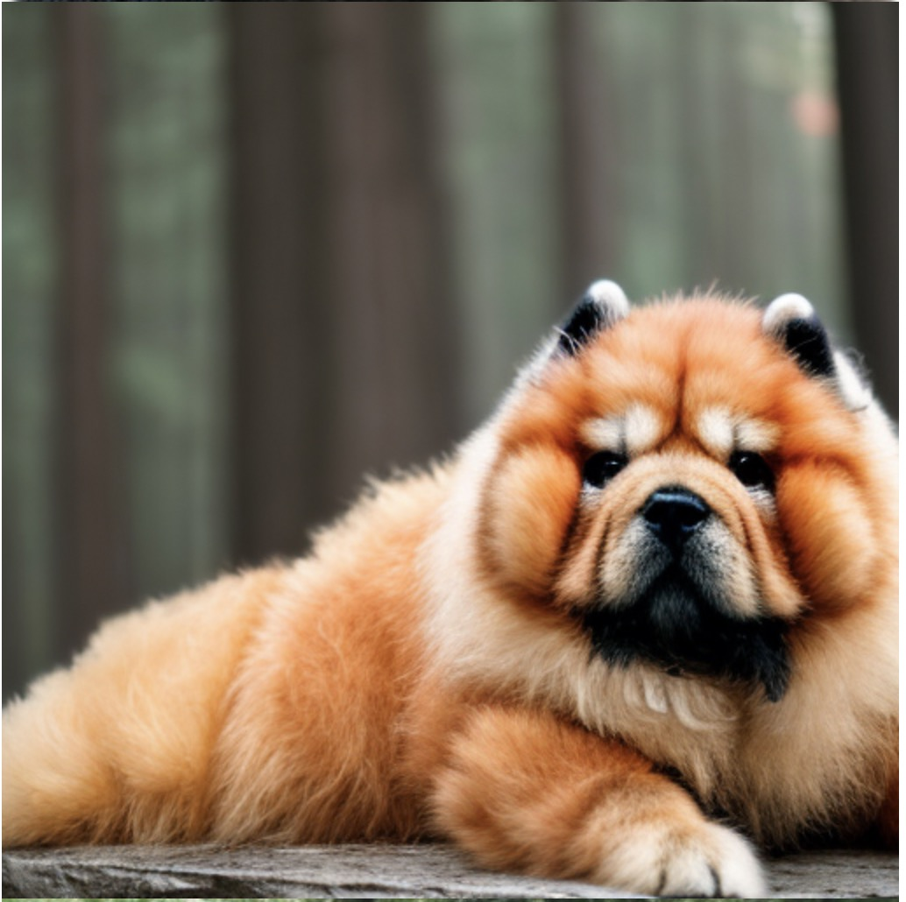

# dreambooth

## 介绍

[梦幻展台 (dreambooth.github.io)](https://dreambooth.github.io/)

## 直接训练部署使用的youtube视频

会python就能够运行，

[DREAMBOOTH: 15 MINS TRAINING In Stable Diffusion In Google Colab! Super Natural Results! No GPU! - YouTube](https://www.youtube.com/watch?v=nofH1K70tpc)

视频里面直接用的colab

[DreamBooth_Stable_Diffusion.ipynb - Colaboratory (google.com)](https://colab.research.google.com/github/ShivamShrirao/diffusers/blob/main/examples/dreambooth/DreamBooth_Stable_Diffusion.ipynb#scrollTo=wnTMyW41cC1E)

我自己稍加修改的colab

[“DreamBooth_Stable_Diffusion.ipynb”的副本 - Colaboratory (google.com)](https://colab.research.google.com/drive/1uqe8u1-vRpe_6FuSa8XXojKn_zbz2ktW#scrollTo=K6xoHWSsbcS3)

官方给的数据集，运行上面的代码你就知道这些数据集是干嘛用的了

[GitHub - google/dreambooth](https://github.com/google/dreambooth)

## paper

[[2208.12242\] DreamBooth: Fine Tuning Text-to-Image Diffusion Models for Subject-Driven Generation (arxiv.org)](https://arxiv.org/abs/2208.12242)

# what

用来微调文字生成图像的大模型的模型

给定5张左右的固定物体或者人物的训练图片集P，和描述的文字A，经过dreambooth训练后，只要你每一次给的提示词都包含A，那就会在P的基础上进行修改

# why

大模型的训练要花费很多时间，金钱。如果我们要优化大模型或者微调大模型，很难实现。所以就想出这种微调模型。

实现每一次生成的图片都是基于同一个事物。

# 能实现的功能

看下面这个介绍

[梦幻展台 (dreambooth.github.io)](https://dreambooth.github.io/)

## 艺术演绎，变化艺术风格

## 合成具有指定视点的图像

上，下左右，的角度

## 属性修改

如改颜色

## 配饰

给图片添加装饰物。

# 自己实现的

## 提示词 photo of zwx dog wearing a police outfit

​	

## a cross photo of zwx dog and a panda

