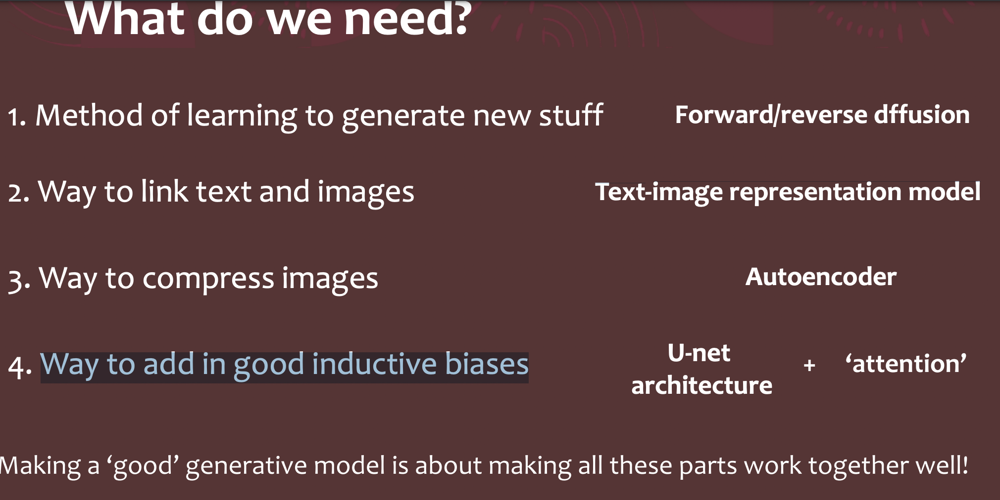
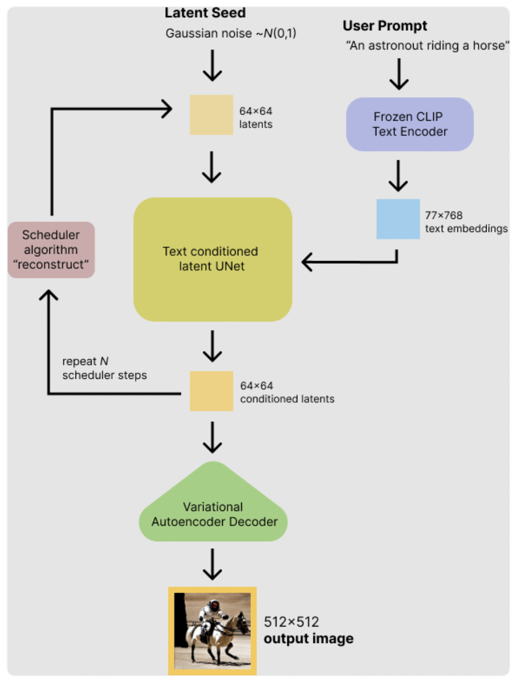
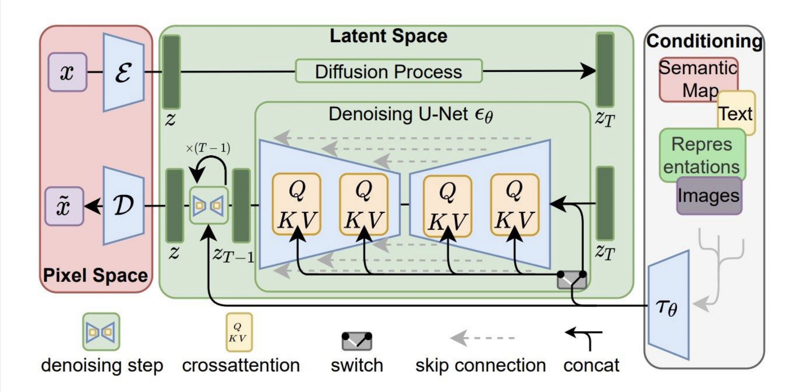

# why study

我想找生成ai方面的工作，找了一堆的招聘信息里面提到了gan，vae，diffusion，stable diffusion，nerf这些内容

问谷歌，b站，知乎，chatGPT（实时）好友，

后来慢慢来了解了上面那些内容中stable diffusion最强.而且很多已经落地了。所以你要学他。

# what 

文生图，图生图的

先查询他是什么 chatGPt，github，谷歌，b站，知乎

22年发布的StabilityAI的Stable Diffusion是一个开源模型，是一个文生图底层大模型。[**CompVis**](https://github.com/CompVis)、 📘[**Stability AI**](https://stability.ai/)和 📘[**LAION**](https://laion.ai/)开源

和他同层次的还有

[**Midjourney**](https://www.midjourney.com/home/) 由同名研究实验室开发（不开源）

[**DALL·E2**](https://openai.com/dall-e-2/)由 📘[**OpenAI**](https://openai.com/)开发（不开源）

他之前在2021年1月，OpenAI发布了两个连接文本与图像的神经网络：DALL・E和 CLIP。DALL・E可以基于文本直接生成图像，CLIP能够完成图像与文本类别的匹配。DALL・E是基于GPT-3的120亿参数版本实现的。

由于开源关系你就应该知道学那一个了

# how study

然后想一下，公司人家需要什么，

# 应用

先在网络上用一下人家弄好的可以直接用的网站或者软件

## 直接跑网页版

省时省力不用安装费事，快速了解


https://huggingface.co/blog/stable_diffusion

丰富的应用功能

https://github.com/camenduru/stable-diffusion-webui-colab

## 跑本地部署项目

没有网页版在跑 有点费时间，费资源，还可能不成功

https://www.youtube.com/watch?v=nwyxpTOmcJ4

###  评估

#### CompVis/stable-diffusion-v1-4

1对于中文完全不兼容，但是，通过翻译可以实现转化。 

2只能生成比较范的描述，如果你的描述过于详细，那是无法完全满足的，所以有待优化，或者换一个模型

这是由于他文本和图像不是较匹配的原因，所以，要从他文本入手

分辨率很高。

# 学习路径

youTube看有没有把。

或者google 上找 用 from scrath。下面的就是朋友通过这种方式找到的

https://scholar.harvard.edu/binxuw/classes/machine-learning-scratch/materials/stable-diffusion-scratch

好友发的

https://course.fast.ai/Lessons/lesson9.html


最后决定看下面的链接

https://scholar.harvard.edu/binxuw/classes/machine-learning-scratch/materials/stable-diffusion-scratch

## 了解到我们要学习什么

扩散模型的原理。 

**使用UNet 模型** 的图像模型评分函数 

**通过语境化词嵌入** 理解提示

让文本通过交叉注意力** 影响图像

通过添加**自动编码器提高效率** 

大规模训练


**以及从里面的幻灯片中可以了解到**



## 具体的学习步骤

从零开始建立稳定扩散模式

扩散模型的原理（采样、学习）。

图像的扩散--UNet架构

理解提示--作为向量的词，CLIP

让词语调节扩散--条件性扩散，交叉注意

潜在空间的扩散--AutoEncoderKL

在海量数据集上进行训练。- LAION 5Billion

## 大体结构

使用 Stable Diffusion 并检查模型的内部架构。（[在 Colab 中打开] (https://colab.research.google.com/drive/1TvOlX2_l4pCBOKjDI672JcMm4q68sKrA?usp=sharing)） 看到Adding Negative prompt这里即可

添加注释的版本

https://colab.research.google.com/drive/13Pal6GGc3PXix7qi0ujIfdXo7FP_s9lU

### 最简单调包结构

由上面案例应用得出

#### 1从库中获得模型工具

```python
from diffusers import StableDiffusionPipeline
pipe = StableDiffusionPipeline.from_pretrained("CompVis/stable-diffusion-v1-4")
```

#### 2给提示词从模型工具获得图片

prompt = "a photograph of an astronaut riding a horse"

image = pipe(prompt).images[0]

#### 调参点

##### 随机种子

generator = torch.Generator("cuda").manual_seed(1024)

##### 质量清晰度

推理步数`50`

num_inference_steps=15

image2 = pipe(prompt, guidance_scale=7.5, num_inference_steps=15, generator=generator).images[0]

##### 图片服从文本的强度

简单来说，它会以牺牲图像质量或多样性为代价，强制生成更好地匹配提示

guidance_scale=7.5

image2 = pipe(prompt, guidance_scale=7.5, num_inference_steps=15, generator=generator).images[0]

### 了解num_inference_steps

了解到diffusion的推理去噪，根据推理步数，每一个推理步数就会给图片去噪生成一个潜在变量，潜在变量通过vae可以变成图片，在把他变成视频。然后我们把他拿出看看一看看。

https://colab.research.google.com/drive/1TvOlX2_l4pCBOKjDI672JcMm4q68sKrA?usp=sharing#scrollTo=wTJ_cLZdSnVu

这个链接里面的Visualizing the Diffusion in Action 开始看

添加注释版本

https://colab.research.google.com/drive/13Pal6GGc3PXix7qi0ujIfdXo7FP_s9lU


##  每个部分，内部的控制关键点以及之间的关系。

我们需要知道他大体的框架结构，都是由哪一些部分组成，每一部分是实现什么功能，他们之间是怎么相互协作，有什么联系。

### 通过更深调包编写更多可调参数的pipe

https://colab.research.google.com/drive/13Pal6GGc3PXix7qi0ujIfdXo7FP_s9lU#scrollTo=ghzfj5N7aGrn

从链接 Write a simple text2img sampling function  看起，看个大概就行， 然后遍看下面那张图

通过上面管道编写可以知道，模型里面的结构和流程以及重要的重要控制点，

1正向负面，提示词通过clip变成词嵌入向量，然后合并

2通过timesteps初始化scheduler， 然后初始化潜在变量

3根据潜在变量，scheduler，以及词向量通过unet得到要去的噪音。 

4根据scheduler，和潜在变量，噪音推理出一下潜在变量，

5把推理出来的噪音通过vae变成照片

6显示

下面是一个推理过程



https://colab.research.google.com/drive/1FiNPi77MRphnXocHihfo9ApabIat7BBp#scrollTo=vSxfVk5GzLy_


用UNet模型建立图像的得分函数模型 
通过上下文的词语嵌入来理解提示 
让文字通过交叉注意影响图像 
通过增加一个自动编码器来提高效率 
大规模的训练。

## 每一个部分的理解

训练过程的结构图




x是一张图片，先将他经过vae的编码变成潜在变量，然后通过扩散过程变成充满噪声的图片 $z_{T}$ ,然后把它放入到unet的去噪过程中，在这个过程吧文本或者图片通过其他模型的转成潜在变量，然后通过自注意力机制，一起影响去噪过程，最后在经过vae变成图片。


### clip

他是基于transformer 后的变体GPT而来的，他的训练集是大量的图片和图片对应的文字。

有图像编码器和文字编码器。分别把他们对应编码，然后去得余弦相似度，当开始这个值很低。然后我们就训练这两个模型，使得相似度变高。

### 扩散模型

到扩散模型专门的笔记中去看

正向

给一张图片不断的 添加 生成的服从高斯分布的噪声得到噪声图片，然后进行训练我们就可以得到一个非常好的噪声生成器

反向

通过这个噪声生成器我们把一个充满噪声的图片慢慢的变成一个原始图片

### unet

我们优化了扩散模型，把图像通过卷积压缩后（称作潜在空间）在扩散训练。

给定一张潜在空间图片，加噪的第t次，经过unet，生成一个噪声，然后加上潜在空间图片，生成新的。

### 自注意力

### 图像生成器（添加文本提示）

前面unet，只能生成精美的图片但是我们不能指定生成什么，于是我们添加了文本提示

把clip生成的文本编码 经过一个自注意力生成的数据 添加到unet生成的潜在变量里面，就是实现了文字影响图片了


### 图像解码器


## 深层理解，数学相关


这是为了下面，复现源码，重构模型做准备的

看懂一下数学理论和结构

终于找到了stable diffusion的组成结构。可以根据课件开始学习了。

### 开始部署本地代码跑模型

首先，知道怎么用代码最简单的调用他实现文生图，即能简单的应用

首先你应该先使用，去github 或者hugging face hub上看一下应该会有直接能用的。找最好的模型看效果看星

github

从[CompVis](https://github.com/CompVis)/**[stable-diffusion](https://github.com/CompVis/stable-diffusion)** 上看到Stable Diffusion was made  by [Stability AI](https://stability.ai/) and [Runway](https://runwayml.com/) 。并且看到一篇论文。

然后看到他们对模型版本一些说明。可以看出这个是最早的模型，然后提供了简单调用案例，其他说明。

然后点击进去查看这两个公司链接

 [Stability AI](https://stability.ai/) 你看完封面你就会看到一个指向stable diffusion的github， https://github.com/Stability-AI/stablediffusion 

提供多个版本的stable diffusion v2 这些是进一步优化的。也说了最初的模型是上面那一个。然后说明一些stable diffusion v2 的优化和本地使用，网络使用。


所以你就可以实现第一步了

hugging face hub

上面有许多模型版本，你不知道那一个合适。

如果你本地GPU不行就直接看一下在kaggle上能不能实现

不需要涉及太多的数学原理，学完下面的，能更加理解上面的调包了。也可以调深一点的包了

# 源码复现

看懂源码，有自己的想法能改进能力，根据已有的论文或者自己能力改进某个方向，然后应用部署

## 查stable diffusion的github，

1从[CompVis](https://github.com/CompVis)/**[stable-diffusion](https://github.com/CompVis/stable-diffusion)** 上看到Stable Diffusion was made  by [Stability AI](https://stability.ai/) and [Runway](https://runwayml.com/) 。并且看到一篇论文。

然后看到他们对模型版本一些说明。明显这个里就不适合学习，因为没讲理论和结构


然后点击进去查看这两个公司链接

2 [Stability AI](https://stability.ai/) 你看完封面你就会看到一个指向stable diffusion的github， https://github.com/Stability-AI/stablediffusion 

提供多个版本的stable diffusion v2 这些是进一步优化的。也说了最初的模型是上面那一个。然后说明一些stable diffusion v2 的优化和本地使用，网络使用。


3Runway 就会看到两个相关链接在最下面，第一个进去https://research.runwayml.com/publications/high-resolution-image-synthesis-with-latent-diffusion-models 提供论文和代码。

第二个直接是一些相关研究

## 看视频

https://www.youtube.com/watch?v=snUceAplmEI

# 追新

追相关的最新的应用和论文，

从youtube，谷歌，chatGPt，b站上找，从知乎上找，从csdn上找


